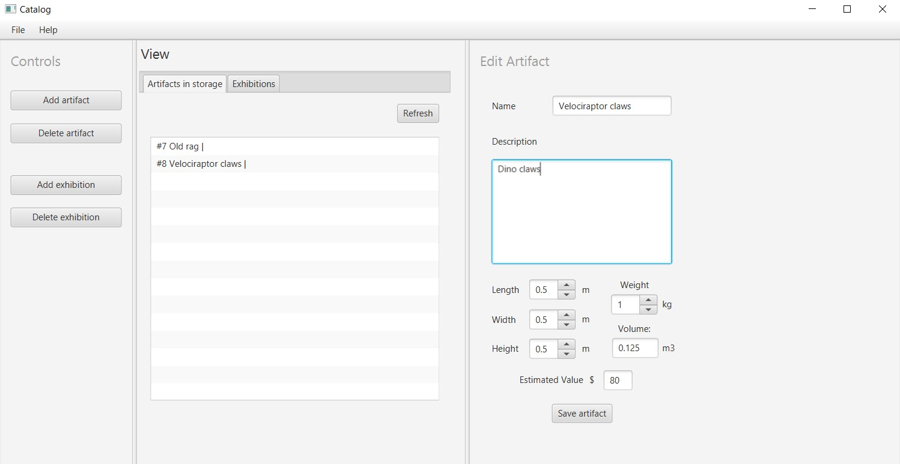

# Catalog

Prototype for a museum artifact cataloguing GUI program, using JavaFX. Artifacts can be moved in
and out of exhibitions, which can also be thought of as categories.

## Running the program

The application is available as a `Catalog.jar`, ready to be run directly. To run Catalog requires:
 
* at least Java 11
* as well as an instance of MySQL is running locally on port 3306.

The database credentials are in `application.properties`.

### Running from source

* Ensure an instance of MySQL is running locally on port 3306, and that there is a connection to a
  database called `catalog` for a user named `catalog` with password `catalog`. The program will
  create the necessary tables if they do not exist.
* Ensure Java 11+ and Maven is installed
* Run the application with `mvn clean javafx:run`

## Program details

A UML diagram `uml.png` is available.

* Users can add and delete artifacts, and move them in and out of exhibitions.
* Artifacts can be in at most one exhibition at a time, and if they are not in one, they are
  'in storage'.
* When an exhibition is deleted, the artifacts it contains are not deleted, they are removed from
  the exhibition and moved to storage.
* Artifacts have volume and weight recorded, and their appraisal value is based on their density,
  multiplied by a fixed scaling factor.
* The value of an exhibition is the sum of its artifacts' values, multiplied by a fixed scaling
  factor.

## Screenshots

